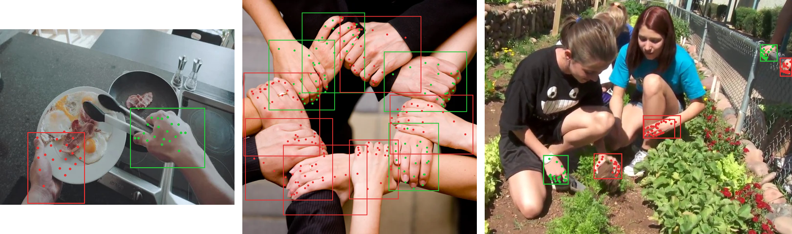

# 3DHandReconstruction on AWS Marketplace — 3D hand localization & reconstruction

Sample notebook, client code, and input/output samples for the **3DHandReconstruction** model package on AWS Marketplace, published by Stefanos Zafeiriou Ltd. 3DHandReconstruction detects every hand in an RGB image — left/right aware — and reconstructs each as a 3D MANO hand: 778-vertex mesh, 21 3D joints, and MANO pose/shape parameters.

This repository is the usage documentation for the product. It contains:

| Path | What it is |
|---|---|
| `sample_notebook.ipynb` | End-to-end notebook: deploy from your subscription, real-time inference, visualization, batch transform, cleanup. Runs on the bundled sample images with no data of your own. |
| `hand_client.py` | Small boto3 client that handles the MANO handshake for you (see [MANO](#the-mano-model-bring-your-own)). |
| `mano_to_npz.py` | One-time converter for your licensed `MANO_RIGHT.pkl`. |
| `make_batch_input.py` | Builds batch-transform JSONL inputs. |
| `samples/` | Sample images (provided by the publisher) and real request/response files for real-time and batch. |



*Detection mode on the bundled samples: boxes, left (red) / right (green), and the 21 detector keypoints — no MANO file needed.*

## Two modes

| Mode | Needs a MANO file? | Returns per hand |
|---|---|---|
| **Detection** (`options.detect_only = true`) | No | bounding box, left/right, detector confidence, 21 2D keypoints |
| **3D reconstruction** (default) | **Yes** | all of the above plus MANO parameters, 21 3D joints, 778-vertex mesh, 2D projection of the mesh, camera translation |

Without a MANO file the endpoint answers reconstruction requests with `{"error": "MANO_REQUIRED"}`.

## The MANO model: bring your own

3D reconstruction is built on the MANO hand model from the Max Planck Institute for Intelligent Systems. **MANO is licensed by MPI and is not — and cannot be — included in this product.** To use 3D reconstruction:

1. Register at <https://mano.is.tue.mpg.de/> and accept MPI's licence. It is free for non-commercial research; **commercial use requires a licence from MPI**, and obtaining the right licence for your use is your responsibility.
2. Download `MANO_RIGHT.pkl` and convert it once (the pickle depends on the unmaintained `chumpy` package, so do this in a throwaway environment):
   ```bash
   pip install "numpy<1.24" chumpy scipy
   python mano_to_npz.py MANO_RIGHT.pkl mano_right.npz
   ```
   The result (`mano_right.npz`, ~3.5 MB) is plain numeric arrays.
3. Send it with your requests (`mano_npz`, base64). `hand_client.py` does this automatically.

**What happens to it:** the endpoint runs with network isolation. Your MANO file is decoded in the instance's memory, cached there by SHA-256, and never written to disk, logged, or transmitted anywhere. When SageMaker replaces or scales an instance, the cache is empty and the endpoint answers `MANO_REQUIRED`; the client re-sends the file once and continues.

## Real-time inference

`Content-Type: application/json`. Request:

```json
{
  "image":    "<base64 JPEG or PNG>",
  "mano_npz": "<base64 mano_right.npz>",        // optional; needed for 3D output
  "options": {                                   // all optional
    "detect_only":    false,   // true = detection mode (no MANO needed)
    "conf":           0.3,     // detector confidence threshold, 0.05–0.9
    "iou":            0.7,     // detector NMS IoU threshold
    "rescale_factor": 2.0,     // crop padding around each hand box
    "mesh":           true     // false = omit the 778 vertices (smaller payload)
  }
}
```

A request with `mano_npz` and no `image` is a warm-up: it caches the file and returns `{"mano_loaded": true, "mano_sha256": "...", "hands": []}`.

Response (reconstruction; detection mode returns only the first four per-hand fields):

```json
{
  "image_size": [width, height],
  "mano_loaded": true,
  "mano_sha256": "<sha256 of the cached MANO file or null>",
  "hands": [
    {
      "bbox_xyxy":       [x0, y0, x1, y1],   // pixels
      "is_right":        1,                  // 1 = right hand, 0 = left
      "detector_conf":   0.84,
      "keypoints_2d_det": [[x, y] × 21],     // detector 2D keypoints (detection mode)
      "cam_t":           [tx, ty, tz],       // camera translation, metres
      "focal_length":    5000.0,             // scaled focal length used for projection
      "mano_params": {
        "global_orient": [[3×3]],            // rotation matrices
        "hand_pose":     [[3×3] × 15],
        "betas":         [10 floats]
      },
      "joints_3d":       [[x, y, z] × 21],   // metres, OpenPose hand order (wrist, thumb, index, middle, ring, pinky)
      "keypoints_2d":    [[x, y] × 778],     // mesh vertices projected into the image
      "vertices":        [[x, y, z] × 778]   // MANO mesh, metres (omitted when options.mesh = false)
    }
  ]
}
```

Left hands are reconstructed with the right-hand MANO model and mirrored; `vertices`/`joints_3d` are already mirrored back into the camera frame. Mesh faces come from your own `mano_right.npz` (`f` array), flipped in winding for left hands — see the notebook.

**Errors** are returned with HTTP 200 and an `error` field so batch jobs don't abort: `MANO_REQUIRED`, `BAD_IMAGE` (undecodable image), `BAD_REQUEST` (malformed body or MANO file).

Samples: [`samples/realtime/request-detect.json`](samples/realtime/request-detect.json) → [`samples/realtime/response-detect.json`](samples/realtime/response-detect.json); reconstruction request shape in [`samples/realtime/request-reconstruct.example.json`](samples/realtime/request-reconstruct.example.json).

Limits (AWS Marketplace ML products): 25 MB per request, 60 s per invocation. Downscale very large photos client-side (~1600 px on the long side is plenty).

## Batch transform

JSON Lines, one request per line, `SplitType=Line`, `BatchStrategy=SingleRecord`, `MaxPayloadInMB=10`, `AssembleWith=Line`. Output is one line per input line, in order. Build inputs with `make_batch_input.py`. **For 3D jobs every line must carry `mano_npz`** — lines are processed independently, so a "send it once" scheme fails non-deterministically on multi-worker jobs.

Samples: [`samples/batch/input.jsonl`](samples/batch/input.jsonl) → [`samples/batch/input.jsonl.out`](samples/batch/input.jsonl.out).

## Instances and performance

| Instance | Mode | Warm latency (single-hand image, incl. network) |
|---|---|---|
| ml.g4dn.xlarge (recommended) | GPU, FP16 | ≈ 0.1 s |
| ml.m5.xlarge | CPU, FP32 | ≈ 2 s |

Supported: ml.m5.\*, ml.c7i.\*, ml.g4dn.\*, ml.g5.\* for real-time; ml.m5.xlarge, ml.g4dn.xlarge, ml.g5.xlarge for batch. One image can contain any number of hands; latency scales roughly per hand.

## Privacy and security

The container runs under SageMaker network isolation: it makes no network calls, downloads nothing, and your images and MANO file stay inside your AWS account and the instance's memory.

## Support

Use the support contact on the AWS Marketplace listing. Include the model package version, region, instance type, and the `error`/`message` fields of any failing response. Do not send your MANO file.
